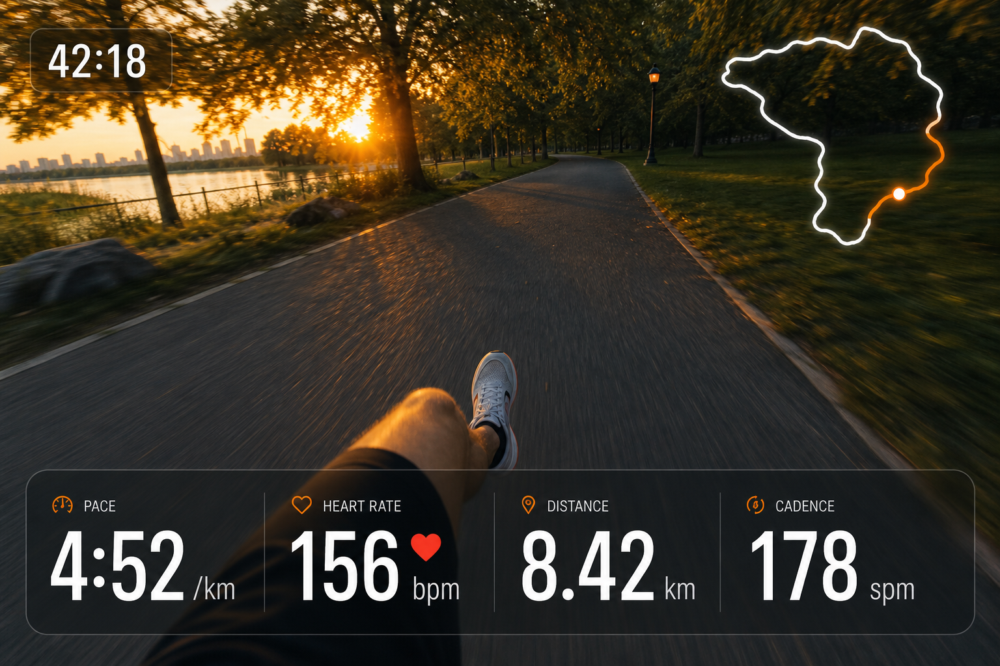
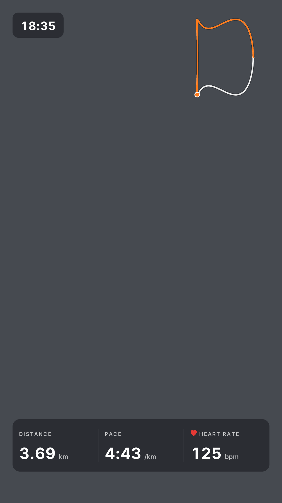
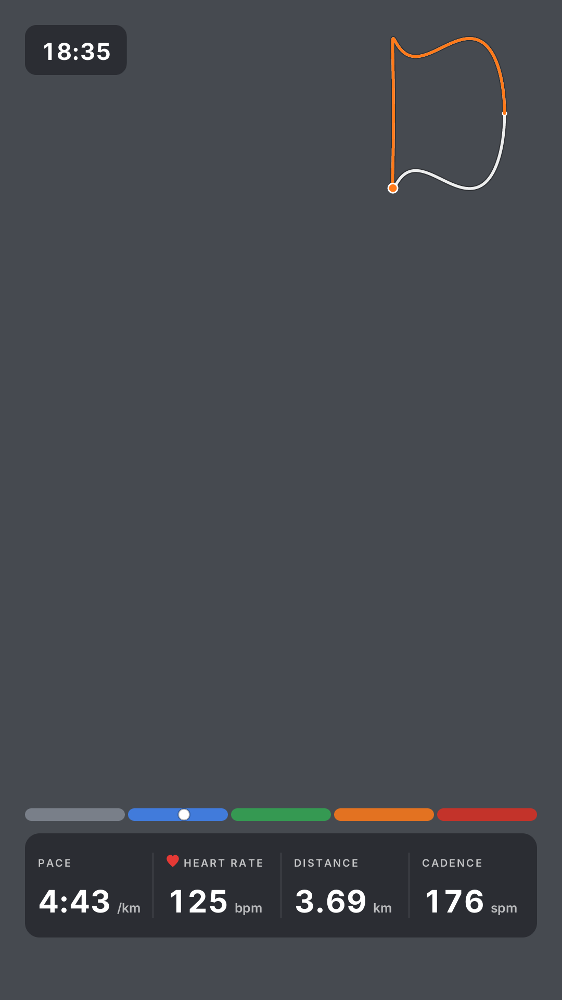
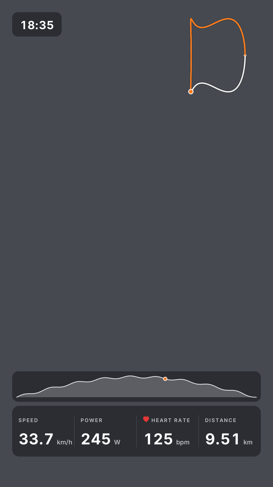
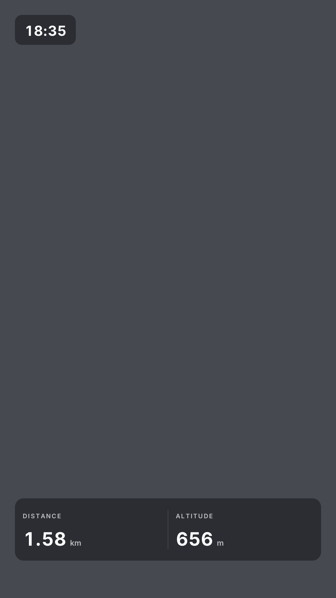

# fitoverlay

fix misalignment between layout and generated image for indoor runs (like the gap between text).

Burns a fitness HUD overlay — transparent "noodle map", heart rate, pace/speed,
distance and more — directly onto Insta360 vertical videos, driven by the
`.fit` activity file recorded by your watch or bike computer.



## How it works

- The `.fit` file is decoded into a 1 Hz timeline (GPS, HR, speed, distance,
  altitude, cadence, power), with linear interpolation between samples and
  pause handling from the FIT timer events.
- Each video's recording start time is parsed from its Insta360 filename
  (`VID_YYYYMMDD_HHMMSS_XX_NNN.mp4`) and converted to UTC using the timezone
  stored in the FIT file, then aligned with the activity timeline.
- Overlay frames are rasterized in-process (tiny-skia + cached glyph blits;
  all static elements are pre-rendered once) and piped as raw RGBA into
  ffmpeg, which composites them over the footage and encodes with hardware
  HEVC (videotoolbox) where available.
- The overlay only appears where video and activity overlap: cameras started
  early show clean footage until the workout begins, and the HUD fades out if
  the workout ends mid-clip. Videos with no overlap are skipped.

## Sport layouts

The layout is picked automatically from the FIT session's sport/sub-sport:

| Sport | Widgets |
| --- | --- |
| Outdoor run | noodle map, pace, HR, distance, cadence |
| Bike ride | noodle map, speed, power, HR, distance |
| Hike / walk | noodle map, elevation profile, distance, elev gain, HR, altitude |
| Indoor run (treadmill) | HR zone bar, pace, HR, distance, cadence |

Metrics missing from the FIT stream (e.g. no power meter) are collapsed
rather than shown blank. Style mockups live in the assets folder.

## Customizing the layout

You can override the automatic sport layouts using these flags:

- `--metrics <list>`: Replace the bottom-row metrics (Options: `pace`, `speed`, `hr`, `distance`, `cadence`, `power`, `elev-gain`, `altitude`).
- `--widgets <list>`: Full set reset (Options: `time`, `metrics`, `map`, `elevation`, `hr-zones`).
- `--widget <name>`: Enable a widget in addition to sport defaults.
- `--no-widget <name>`: Disable a specific widget.

### Examples

**Custom metric order:**
```bash
fitoverlay --fit run.fit --metrics distance,pace,hr VID_*.mp4
```


**Add HR Zones to an outdoor run:**
```bash
fitoverlay --fit run.fit --widget zones VID_*.mp4
```


**Add elevation profile to a bike ride:**
```bash
fitoverlay --fit ride.fit --widget elevation VID_*.mp4
```


**Minimalist view (no map, specific metrics):**
```bash
fitoverlay --fit hike.fit --widgets time,metrics --metrics distance,altitude VID_*.mp4
```


## Requirements

- Rust (stable)
- `ffmpeg` and `ffprobe` on PATH (`brew install ffmpeg`)

## Usage

```bash
cargo build --release

# Single video
./target/release/fitoverlay --fit morning-run.fit VID_20260607_170953_00_017.mp4

# Multiple clips from the same workout; outputs go to out/<name>_overlay.mp4
./target/release/fitoverlay --fit ride.fit --out out VID_*.mp4
```

### Options

| Flag | Default | Meaning |
| --- | --- | --- |
| `--fit <file>` | required | The .fit activity file |
| `--out <dir>` | `out` | Output directory |
| `--sync-offset <secs>` | `0` | Fine-tune timing; positive shifts activity data later relative to the video |
| `--utc-offset <±hh:mm>` | from FIT | Camera clock UTC offset, if the FIT file lacks timezone info or the camera clock differs |
| `--max-hr <bpm>` | `190` | Max HR for the indoor zone bar |
| `--encoder <auto\|hevc\|h264>` | `auto` | `auto` uses hevc_videotoolbox when available, else libx264 |
| `--metrics <list>`| sport default | Comma-separated metrics for the bottom row |
| `--widgets <list>`| sport default | Reset to specific widget set |
| `--widget <name>` | none          | Enable a widget in addition to defaults |
| `--no-widget <name>`| none        | Disable a default widget |

### Tuning sync

The Insta360 filename timestamp has 1-second resolution and the camera clock
can drift. If the overlay leads or lags the footage, eyeball a moment you can
identify in both (a turn, a stop) and pass the difference as
`--sync-offset` (positive = data appears later in the video).

## Development

```bash
cargo test                                       # unit tests (sync, projection, interpolation, formatting)
cargo test render_layout_previews -- --ignored   # writes target/previews/*.png, one per sport layout
```
