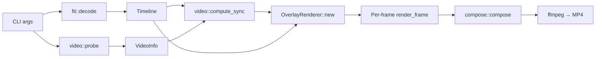
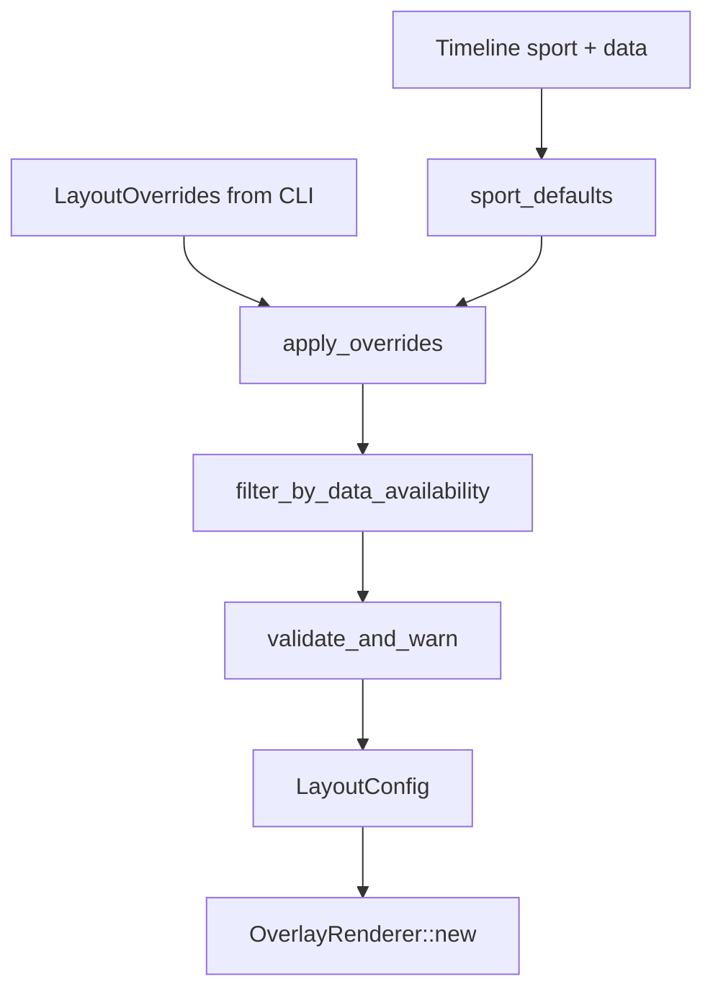

# Specification: Customizable Video Overlay Layouts

**Branch:** `feature/customizable-overlay-layouts`  
**Project:** `fitoverlay` — Rust CLI that burns FIT-activity HUD overlays onto Insta360 videos  
**Audience:** Implementer with JavaScript/Python background, new to Rust  
**Status:** Implementation spec (pre-code)

---

## Table of contents

1. [Goals and non-goals](#1-goals-and-non-goals)
2. [Rust primer (for JS/Python developers)](#2-rust-primer-for-jspython-developers)
3. [Current codebase walkthrough](#3-current-codebase-walkthrough)
4. [How layouts work today](#4-how-layouts-work-today)
5. [Gap analysis](#5-gap-analysis)
6. [Proposed architecture](#6-proposed-architecture)
7. [CLI design](#7-cli-design)
8. [File-by-file implementation plan](#8-file-by-file-implementation-plan)
9. [Validation and warnings](#9-validation-and-warnings)
10. [Testing plan](#10-testing-plan)
11. [Documentation and manual QA deliverables](#11-documentation-and-manual-qa-deliverables)
12. [Future SaaS path](#12-future-saas-path)
13. [Implementation milestones](#13-implementation-milestones)

---

## 1. Goals and non-goals

### Goals

| Requirement | Deliverable |
|---|---|
| Custom metric order | `--metrics pace,hr,distance` |
| Widget enable/disable | `--widgets` and/or granular toggles |
| Clean config layer | New `LayoutConfig` module, not scattered `if` flags in `main.rs` |
| Conflict validation | Warnings to stderr; safe fallbacks |
| Backwards compatibility | No flags → identical output to today |
| Tests | Config parsing, layout resolution, renderer behavior |
| Docs/examples | README + preview PNGs + example CLI for real YT workflows |

### Non-goals (this branch)

- JSON/YAML config files on disk (serde is already a dependency — design for it, don't ship yet)
- Web/mobile UI, Strava/Garmin APIs
- Changing FIT decoding, ffmpeg pipeline, or sync math
- New visual designs (only recomposing existing widgets/metrics)

---

## 2. Rust primer (for JS/Python developers)

Rust is **compiled**: `cargo build` produces a native binary (`target/release/fitoverlay`). There is no interpreter at runtime. Types are checked at compile time, which catches many bugs before you run anything.

### Concepts you'll see in this repo

| Rust concept | JS/Python analogue | Where it appears |
|---|---|---|
| `mod foo;` / `mod render;` | `import` / `from x import` | `src/main.rs` line 1–4 |
| `struct Cli` | Options object / dataclass | `main.rs` — CLI args |
| `enum SportKind` | Union type / string enum | `fit.rs` — sport variants |
| `Option<T>` | `T \| None` / `Optional[T]` | Almost everywhere (`hr: Option<f64>`) |
| `Result<T>` | try/except return pattern | `decode() -> Result<Timeline>` |
| `&Timeline` | Borrowed reference (read-only pointer) | Passed into renderer, no copy |
| `Vec<T>` | `list` / `Array` | `samples`, `cells`, metric lists |
| `match` | `switch` / `if/elif` chain | Sport detection, metric formatting |
| `impl Trait for Type` | Class methods | `impl OverlayRenderer`, `impl MetricKind` |
| `#[derive(Parser)]` | argparse/click decorator | `clap` generates CLI parser |
| `#[cfg(test)] mod tests` | `if __name__ == "__main__"` test block | Bottom of each `.rs` file |
| `?` operator | Propagate exception | `let x = foo()?;` returns early on error |

### Project layout

```
fitoverlay/
├── Cargo.toml          # package.json / pyproject.toml (deps, name, version)
├── src/
│   ├── main.rs         # Entry point: CLI parse → decode FIT → render loop
│   ├── fit.rs          # FIT file → Timeline (GPS, HR, speed, pauses)
│   ├── video.rs        # ffprobe + Insta360 filename → sync mapping
│   ├── compose.rs      # Pipe RGBA frames into ffmpeg
│   └── render/
│       ├── mod.rs      # OverlayRenderer — THE layout logic lives here
│       ├── map.rs      # GPS noodle map geometry
│       └── text.rs     # Font glyph cache
├── assets/             # Fonts + style preview PNGs
└── docs/               # This spec
```

### Build & test commands

```bash
cargo build --release          # compile optimized binary
cargo test                     # run all unit tests
cargo test layout --           # run tests whose name contains "layout"
cargo test render_layout_previews -- --ignored   # write PNG previews
```

---

## 3. Current codebase walkthrough

### End-to-end pipeline



**Step-by-step (what `main.rs` does today):**

1. **Parse CLI** via `clap` (`Cli` struct, lines 15–51).
2. **Decode FIT** → `Timeline` with 1 Hz samples, sport kind, GPS flag, pauses.
3. **Resolve UTC offset** for camera clock (FIT file, `--utc-offset`, or system TZ).
4. **For each video:**
   - `video::probe` — dimensions, fps, duration, Insta360 start time from filename.
   - `video::compute_sync` — when overlay is visible in video time.
   - `OverlayRenderer::new` — **pre-render static HUD** (panels, map, labels).
   - `compose::compose` — for each video frame, call `render_frame`, pipe RGBA to ffmpeg.

### Module responsibilities

#### `fit.rs` — Activity data layer

- Reads Garmin `.fit` binary via `fitparser` crate.
- Outputs `Timeline { sport, samples, pauses, has_gps, ... }`.
- `Timeline::snapshot(t)` — interpolated HR/speed/distance/etc. at activity second `t`.
- `detect_sport()` maps FIT sport strings → `SportKind` enum (4 layouts).

**Key types:**

```rust
pub enum SportKind { OutdoorRun, IndoorRun, BikeRide, Hike }
pub struct Sample { t, lat, lon, hr, speed, dist, alt, cadence, power, ascent, ... }
pub struct Snapshot { hr, speed, dist, alt, ... moving_secs, paused }
```

#### `video.rs` — Video probing & sync

- Parses `VID_YYYYMMDD_HHMMSS_XX_NNN.mp4` → local recording start.
- `ffprobe` JSON → width, height, fps, duration.
- `compute_sync` maps video time ↔ activity time; returns visible window `(lo, hi)`.

#### `compose.rs` — ffmpeg glue

- Spawns ffmpeg with two inputs: source video + raw RGBA overlay stream on stdin.
- `ComposeOptions { preview_fps }` for fast layout checks (`--preview-fps 1`).

#### `render/mod.rs` — Visual layout (primary change target)

**Efficiency model:** Static elements (panel backgrounds, labels, full route outline, elevation fill, zone bar segments) are drawn **once** at init. Each frame only updates: elapsed time text, metric values, traveled map segment, position dots.

**HUD pieces (widgets):**

| Widget | Internal struct | When created today |
|---|---|---|
| Time chip (top-left) | `TimeChip` | Always |
| Bottom metric panel | `cells: Vec<Cell>` | If `visible_metrics()` non-empty |
| Noodle map (top-right) | `MapWidget` | GPS + not indoor run |
| Elevation profile | `ElevWidget` | Hike + altitude data |
| HR zone bar | `ZoneWidget` | Indoor run + HR data |

#### `render/map.rs` — Geometry only

- `Track::from_gps` — project lat/lon into widget box.
- `Track::elevation_profile` — altitude over time chart.
- No layout/sport knowledge.

---

## 4. How layouts work today

### Sport → default metrics

Hardcoded in `visible_metrics()` (`render/mod.rs`, lines 637–671):

| Sport | Default metric order (before data filter) |
|---|---|
| Outdoor run | pace → HR → distance → cadence |
| Indoor run | pace → HR → distance → cadence |
| Bike ride | speed → power → HR → distance |
| Hike | distance → elev gain → HR → altitude |

**Data filter:** Metrics without FIT data are dropped (e.g. no power meter → power column omitted). This is *not* the same as showing `"--"` — the column disappears entirely.

```637:671:src/render/mod.rs
fn visible_metrics(tl: &Timeline) -> Vec<MetricKind> {
    let wanted: &[MetricKind] = match tl.sport {
        SportKind::OutdoorRun | SportKind::IndoorRun => &[
            MetricKind::Pace,
            MetricKind::HeartRate,
            MetricKind::Distance,
            MetricKind::Cadence,
        ],
        // ...
    };
    wanted.iter().copied().filter(|k| /* has data in timeline */).collect()
}
```

### Sport → default widgets

Encoded as conditionals inside `OverlayRenderer::new()`:

```386:480:src/render/mod.rs
// Map: tl.has_gps && tl.sport != SportKind::IndoorRun
// Elev: tl.sport == SportKind::Hike && tl.has_field(|s| s.alt.is_some())
// Zone: tl.sport == SportKind::IndoorRun && tl.has_field(|s| s.hr.is_some())
```

### Metric display identifiers

Internal enum `MetricKind` (`render/mod.rs`, lines 47–57):

| Internal | CLI alias (proposed) | Label on screen |
|---|---|---|
| `Pace` | `pace` | PACE |
| `Speed` | `speed` | SPEED |
| `HeartRate` | `hr`, `heart-rate` | HEART RATE |
| `Distance` | `distance`, `dist` | DISTANCE |
| `Cadence` | `cadence` | CADENCE |
| `Power` | `power` | POWER |
| `ElevGain` | `elev-gain`, `elevation-gain`, `gain` | ELEV GAIN |
| `Altitude` | `altitude`, `alt`, `elevation` | ALTITUDE |

### What the client wants beyond defaults

From the job description:

- **Outdoor run:** add optional elevation profile, HR zone bar (not in defaults today).
- **Bike ride:** add optional elevation, HR zones.
- **Hike:** already has elevation; may want HR zones, different metric order.
- **All sports:** reorder bottom metrics row via `--metrics`.

---

## 5. Gap analysis

| Area | Today | Needed |
|---|---|---|
| Metric order | Fixed per sport in `visible_metrics()` | User override via `--metrics` |
| Widgets | Fixed per sport in `OverlayRenderer::new` | User override via `--widgets` / toggles |
| Configuration | Implicit in sport enum + inline `if` | Explicit `LayoutConfig` resolved once |
| CLI | `fit`, `videos`, sync/encoder options only | Layout flags + validation messages |
| Tests | Formatting, sync, layout pixel gaps | Config parsing, override resolution, widget gating |
| Docs | Static sport table | Examples showing custom combos |

**Important constraint:** `OverlayRenderer::new` allocates panel geometry based on metric **count**. Changing metrics requires rebuilding the renderer (already per-video today — acceptable).

---

## 6. Proposed architecture

### New module: `src/layout.rs`

Single source of truth for "what to show". Separates **user intent** from **resolved layout** after sport defaults, overrides, and data availability.

```rust
// src/layout.rs (proposed)

/// User-facing metric tokens from CLI.
#[derive(Debug, Clone, Copy, PartialEq, Eq, Hash)]
pub enum MetricId { Pace, Speed, HeartRate, Distance, Cadence, Power, ElevGain, Altitude }

/// Overlay widgets (not individual metrics).
#[derive(Debug, Clone, Copy, PartialEq, Eq, Hash)]
pub enum WidgetId {
    TimeChip,      // elapsed moving time + PAUSED badge
    MetricsPanel,  // bottom bar (requires ≥1 metric)
    Map,           // noodle map
    Elevation,     // elevation profile chart
    HrZones,       // indoor-style 5-zone bar + marker
}

/// Raw CLI / future API input (partial — None means "don't override").
#[derive(Debug, Clone, Default)]
pub struct LayoutOverrides {
    pub metrics: Option<Vec<MetricId>>,           // from --metrics
    pub widgets: Option<WidgetSet>,               // from --widgets
    pub disable_widgets: Vec<WidgetId>,           // from --no-widget (repeatable)
    pub enable_widgets: Vec<WidgetId>,            // from --widget (repeatable)
}

/// Fully resolved layout for one activity.
#[derive(Debug, Clone)]
pub struct LayoutConfig {
    pub metrics: Vec<MetricId>,
    pub widgets: WidgetSet,
    pub warnings: Vec<String>,  // emitted by main after resolve
}

bitflags or Vec — recommend simple `WidgetSet` struct:
pub struct WidgetSet {
    pub time_chip: bool,
    pub metrics_panel: bool,
    pub map: bool,
    pub elevation: bool,
    pub hr_zones: bool,
}
```

### Resolution pipeline



**Functions to implement:**

```rust
impl LayoutConfig {
    /// Main entry: sport defaults + overrides + timeline data → final layout.
    pub fn resolve(tl: &Timeline, overrides: &LayoutOverrides, max_hr: f64) -> Self;

    pub fn default_metrics_for(sport: SportKind) -> Vec<MetricId>;
    pub fn default_widgets_for(sport: SportKind) -> WidgetSet;
}

impl MetricId {
    pub fn parse_list(s: &str) -> Result<Vec<MetricId>, ParseError>;
    pub fn to_metric_kind(self) -> MetricKind;  // bridge to render enum
}

impl WidgetId {
    pub fn parse_list(s: &str) -> Result<WidgetSet, ParseError>;
}
```

### Bridge to renderer

Keep `MetricKind` inside `render/mod.rs` (it has formatting logic). `layout.rs` owns IDs and resolution; render receives `&LayoutConfig` and maps `MetricId → MetricKind`.

**Change renderer signature:**

```rust
// Before
pub fn new(tl: &Timeline, width: u32, height: u32, max_hr: f64) -> Result<Self>

// After
pub fn new(
    tl: &Timeline,
    width: u32,
    height: u32,
    max_hr: f64,
    layout: &LayoutConfig,
) -> Result<Self>
```

Replace `visible_metrics(tl)` with:

```rust
fn resolve_metric_kinds(tl: &Timeline, layout: &LayoutConfig) -> Vec<MetricKind> {
    layout.metrics.iter()
        .map(|id| id.to_metric_kind())
        .filter(|k| metric_has_data(tl, *k))
        .collect()
}
```

Replace widget `if` blocks with `layout.widgets.map`, `layout.widgets.elevation`, etc.

---

## 7. CLI design

### Recommended flags

| Flag | Type | Default | Description |
|---|---|---|---|
| `--metrics <list>` | comma-separated | *(sport default)* | Override bottom metric row order |
| `--widgets <list>` | comma-separated | *(sport default)* | **Replace** entire widget set |
| `--widget <name>` | repeatable | — | Enable one widget on top of defaults |
| `--no-widget <name>` | repeatable | — | Disable one widget from defaults |

**Precedence (highest wins):**

1. If `--widgets` is set → use exactly that set (then data-filter + warn).
2. Else start from sport defaults → apply each `--widget` → apply each `--no-widget`.

Rationale: `--widgets map,metrics,time` gives full control for power users; `--widget hr-zones` gives simple "add HR zones to my outdoor run" without re-listing everything.

### Accepted tokens

**Metrics** (case-insensitive):

```
pace | speed | hr | heart-rate | distance | dist | cadence |
power | elev-gain | elevation-gain | gain | altitude | alt | elevation
```

**Widgets:**

```
time | time-chip          → TimeChip
metrics | metrics-panel  → MetricsPanel
map | noodle             → Map
elevation | elev-profile → Elevation
hr-zones | zones         → HrZones
```

### Example commands

```bash
# Default — unchanged behavior
fitoverlay --fit run.fit VID_20260607_170953_00_017.mp4

# Reorder metrics on outdoor run
fitoverlay --fit run.fit --metrics pace,distance,hr,cadence VID_*.mp4

# Add HR zone bar to outdoor run (keep other defaults)
fitoverlay --fit run.fit --widget hr-zones VID_*.mp4

# Bike ride with elevation profile + custom metrics
fitoverlay --fit ride.fit \
  --metrics speed,hr,power,distance \
  --widget elevation \
  VID_*.mp4

# Minimal overlay: time + metrics only, no map
fitoverlay --fit hike.fit \
  --widgets time,metrics \
  --metrics distance,altitude,hr \
  VID_*.mp4

# Fast preview of a custom layout
fitoverlay --fit run.fit --metrics hr,pace --widget elevation --preview-fps 1 VID_*.mp4
```

### `main.rs` CLI struct changes

Add to `Cli`:

```rust
/// Comma-separated metrics for the bottom HUD row (e.g. pace,hr,distance).
#[arg(long, value_delimiter = ',')]
metrics: Option<Vec<String>>,

/// Comma-separated widget set replacing sport defaults (e.g. time,map,metrics).
#[arg(long, value_delimiter = ',')]
widgets: Option<Vec<String>>,

/// Enable a widget in addition to sport defaults. Repeatable.
#[arg(long = "widget")]
enable_widget: Vec<String>,

/// Disable a widget from sport defaults. Repeatable.
#[arg(long = "no-widget")]
disable_widget: Vec<String>,
```

**Wire-up in `main()`** (after `decode`, before render loop):

```rust
let overrides = layout::LayoutOverrides::from_cli(&cli)?;
let layout = layout::LayoutConfig::resolve(&timeline, &overrides, cli.max_hr);
for w in &layout.warnings {
    eprintln!("warning: {w}");
}
// ...
let mut renderer = render::OverlayRenderer::new(
    &timeline, info.width, info.height, cli.max_hr, &layout,
)?;
```

---

## 8. File-by-file implementation plan

### 8.1 NEW: `src/layout.rs` (~350–450 lines)

**Responsibilities:**

1. `MetricId`, `WidgetId`, `WidgetSet`, `LayoutOverrides`, `LayoutConfig`
2. `parse_metric_token`, `parse_widget_token` with friendly errors
3. `LayoutOverrides::from_cli(cli: &Cli) -> Result<Self>`
4. `LayoutConfig::resolve(...)` — core logic
5. `metric_has_data(tl, metric) -> bool` — extract from current `visible_metrics` filter
6. `widget_has_data(tl, widget) -> bool`:
   - `Map` → `tl.has_gps`
   - `Elevation` → `tl.has_field(|s| s.alt.is_some())`
   - `HrZones` → `tl.has_field(|s| s.hr.is_some())`
   - `TimeChip`, `MetricsPanel` → always true if enabled
7. Unit tests (see §10)

**Default tables to codify:**

```rust
fn default_metrics_for(sport: SportKind) -> Vec<MetricId> {
    match sport {
        SportKind::OutdoorRun | SportKind::IndoorRun =>
            vec![Pace, HeartRate, Distance, Cadence],
        SportKind::BikeRide =>
            vec![Speed, Power, HeartRate, Distance],
        SportKind::Hike =>
            vec![Distance, ElevGain, HeartRate, Altitude],
    }
}

fn default_widgets_for(sport: SportKind) -> WidgetSet {
    WidgetSet {
        time_chip: true,
        metrics_panel: true,
        map: matches!(sport, OutdoorRun | BikeRide | Hike), // not indoor
        elevation: sport == SportKind::Hike,
        hr_zones: sport == SportKind::IndoorRun,
    }
}
```

### 8.2 MODIFY: `src/main.rs`

| Change | Detail |
|---|---|
| `mod layout;` | Register new module |
| Extend `Cli` | Four new layout flags (§7) |
| `main()` | Build `LayoutOverrides`, `resolve`, print warnings |
| `OverlayRenderer::new` call | Pass `&layout` |
| Optional test | `cli_parses_layout_flags` using `clap` try_parse_from |

### 8.3 MODIFY: `src/render/mod.rs`

| Change | Detail |
|---|---|
| `OverlayRenderer::new` | Accept `layout: &LayoutConfig` |
| Remove `visible_metrics(tl)` | Replace with `resolve_metric_kinds(tl, layout)` |
| Map widget gate | `layout.widgets.map && widget_has_data` |
| Elev widget gate | `layout.widgets.elevation && ...` |
| Zone widget gate | `layout.widgets.hr_zones && ...` |
| Time chip | Skip static draw if `!layout.widgets.time_chip` (or always keep — recommend always keep time; `--no-widget time` disables) |
| Metrics panel | If `!layout.widgets.metrics_panel` OR metrics empty → no panel, no cells |
| `render_frame` | Guard dynamic draws with same flags (time text, cells, map, elev, zone) |
| Export `visible_metrics` logic | Move data-availability checks to `layout.rs` or shared `metric_has_data` |
| Tests | Update `metric_units_clear_cell_dividers` to pass explicit `LayoutConfig::resolve` |

**Elevation positioning note:** Today elevation chart Y position is computed relative to `panel_y`. If metrics panel is disabled but elevation enabled, define fallback `panel_y` at bottom margin (document in code comment).

### 8.4 MODIFY: `src/render/mod.rs` — `MetricKind` visibility

Option A (minimal): `layout::MetricId` converts to `MetricKind` in render.  
Option B (cleaner long-term): move `MetricKind` to `layout.rs`.  

**Recommend Option A** for smaller diff.

### 8.5 MODIFY: `README.md`

Add sections:

- **Custom layouts** — copy real examples from §7
- **Metrics reference** — token table
- **Widgets reference** — what each widget does per sport
- **Warnings** — example stderr output
- Update options table with new flags
- Add `assets/style-outdoor-run-hr-zones.png` etc. after generating previews

### 8.6 MODIFY: `assets/` preview images

Regenerate via extended ignored test:

```rust
#[test]
#[ignore]
fn render_custom_layout_previews() { /* ... */ }
```

Suggested preview matrix:

| File | Layout |
|---|---|
| `style-outdoor-run-custom-metrics.png` | `--metrics distance,pace,hr` |
| `style-outdoor-run-hr-zones.png` | default + `--widget hr-zones` |
| `style-bike-elevation.png` | `--widget elevation` |
| `style-hike-minimal.png` | `--widgets time,metrics --metrics distance,altitude` |

### 8.7 NO CHANGES (unless bugs found)

- `fit.rs` — sport detection stays
- `video.rs` — sync unchanged
- `compose.rs` — unchanged
- `render/map.rs`, `render/text.rs` — unchanged

### 8.8 OPTIONAL: `src/lib.rs`

Not required today (`main.rs` is binary root). If you want integration tests as a separate crate module, add `lib.rs` exporting `layout`, `render`, `fit`. **Defer** unless you hit testability limits.

---

## 9. Validation and warnings

All warnings go to **stderr** (`eprintln!`); processing continues with safe fallbacks.

| Condition | Warning | Behavior |
|---|---|---|
| Unknown metric token `heartrate` | `unknown metric 'heartrate'; valid: pace, hr, ...` | **Error** — exit before render |
| Duplicate metric in `--metrics pace,pace,hr` | `duplicate metric 'pace' ignored` | Dedupe, keep first |
| Metric requested but no FIT data | `metric 'power' omitted (no data in FIT file)` | Skip column |
| `--metrics` results in empty row | `no metrics to display; metrics panel hidden` | Hide metrics panel |
| `--widget hr-zones` but no HR data | `widget 'hr-zones' omitted (no heart rate in FIT file)` | Skip widget |
| `--widget map` but no GPS | `widget 'map' omitted (no GPS in FIT file)` | Skip widget |
| `--widget elevation` but no altitude | `widget 'elevation' omitted (no altitude in FIT file)` | Skip widget |
| `pace` on bike ride | *(no warning)* | Show pace computed from speed (already works via `MetricKind::Pace`) |
| `speed` on outdoor run | *(no warning)* | Show speed column |
| `--no-widget map` on indoor run | *(no warning)* | Already no map |
| `--widgets` conflicts with `--widget` | `warning: --widgets replaces defaults; --widget/--no-widget flags also present` | Apply precedence from §7 |
| Indoor run + `--widget map` without GPS | `widget 'map' omitted (no GPS in FIT file)` | Skip |
| HR zones on outdoor run without `--max-hr` change | — | Uses existing `--max-hr` (default 190) |

**Errors (exit non-zero):**

- Empty `--metrics` string
- Empty `--widgets` string
- All tokens invalid in a list

---

## 10. Testing plan

### 10.1 New tests in `src/layout.rs`

| Test | Asserts |
|---|---|
| `default_metrics_match_sport` | Each sport matches current `visible_metrics` order |
| `default_widgets_match_sport` | Map/elev/zones flags match current conditionals |
| `parse_metrics_case_insensitive` | `HR` → `HeartRate` |
| `parse_metrics_rejects_unknown` | Error message lists valid tokens |
| `parse_metrics_dedupes` | `pace,pace,hr` → 2 columns |
| `metrics_override_reorders` | `pace,hr,distance` order preserved |
| `metrics_override_filters_missing_data` | No HR in FIT → `hr` dropped + warning |
| `widget_enable_adds_hr_zones_outdoor` | Outdoor default + enable → `hr_zones: true` |
| `widget_disable_removes_map` | `--no-widget map` → `map: false` |
| `widgets_flag_replaces_defaults` | `--widgets time,metrics` → no map |
| `resolve_empty_metrics_hides_panel` | `metrics_panel: false` or empty cells |
| `conflicting_cli_precedence` | `--widgets` beats `--widget` |
| `warnings_collect_expected_messages` | Snapshot of warning strings |

### 10.2 Updates in `src/render/mod.rs`

| Test | Change |
|---|---|
| `metric_units_clear_cell_dividers` | Pass custom `LayoutConfig` with all metrics |
| NEW: `custom_metrics_change_cell_count` | `--metrics hr,pace` → 2 cells, panel still renders |
| NEW: `hr_zones_on_outdoor_run` | Enable zones → zone marker draws when HR present |
| NEW: `elevation_on_bike_run` | Enable elevation on `BikeRide` synth timeline |
| `render_layout_previews` | Add custom layout PNG outputs |

### 10.3 New tests in `src/main.rs` (CLI integration)

Use `Cli::try_parse_from(&["fitoverlay", "--fit", "x.fit", "--metrics", "pace,hr", "v.mp4"])`:

- Parses successfully
- Maps to correct `LayoutOverrides`

### 10.4 Existing suites — must stay green

```bash
cargo test
```

Current coverage (~30 tests): UTC offset, fade, FIT interpolation, sync, formatting, pixel gap layout tests, map projection.

### 10.5 Manual QA matrix

| # | Sport | CLI | Verify |
|---|---|---|---|
| 1 | Outdoor run | *(none)* | Pixel-identical to pre-change baseline |
| 2 | Outdoor run | `--metrics pace,hr,distance` | 3 columns, correct order |
| 3 | Outdoor run | `--widget hr-zones` | Zone bar above metrics |
| 4 | Outdoor run | `--widget elevation` | Elevation chart (if alt in FIT) |
| 5 | Bike | `--widget elevation` | Map + elevation coexist |
| 6 | Hike | `--no-widget elevation` | No elev chart, metrics remain |
| 7 | Indoor | `--widget map` | No map (no GPS), warning |
| 8 | Any | `--widgets time,metrics` | No map |
| 9 | Any | `--preview-fps 1` | Fast output, layout correct |
| 10 | Any | bad token `--metrics foo` | Clean error, exit 1 |

**Deliverable:** Screen recordings or encoded clips for rows 1–4 minimum; PNG previews for docs.

---

## 11. Documentation and manual QA deliverables

### README additions (practical, non-generic)

Write examples tied to real workflows:

1. **"I want distance first on my marathon clips"**  
   `--metrics distance,pace,hr,cadence`

2. **"I film trail runs on Insta360 but want Strava-style elevation"**  
   `--widget elevation --metrics pace,hr,elevation-gain,distance`

3. **"Minimal clean overlay for biking reels"**  
   `--widgets time,map,metrics --metrics speed,power`

4. **"Treadmill run but show HR zones like Peloton"**  
   Already default; document `--max-hr 185` tuning

### YouTube documentation note

Client asked for practical examples linked to YT videos. In README, add a **Examples** subsection with:

- Placeholder links `[Outdoor run + HR zones (YT)]` to be filled after manual tests
- Exact command used to produce each example
- Thumbnail from `assets/` preview PNG

### Preview generation workflow

```bash
cargo test render_layout_previews -- --ignored
cargo test render_custom_layout_previews -- --ignored   # new
cp target/previews/*.png assets/
```

---

## 12. Future SaaS path

The `LayoutConfig` struct is intentionally serializable later:

```rust
// Future (not this branch):
#[derive(Serialize, Deserialize)]
pub struct LayoutConfig { ... }
```

Mapping to product concepts:

| CLI today | Future SaaS |
|---|---|
| `LayoutOverrides` | User saved preset / mobile app toggle state |
| `LayoutConfig::resolve` | Server-side render job payload |
| `MetricId` / `WidgetId` | API enum values |
| warnings | In-app toast / job log |

Keeping resolution pure (`Timeline + Overrides → LayoutConfig`) means a future HTTP handler can call the same function without duplicating logic.

---

## 13. Implementation milestones

### Milestone 1 — Config layer (no visual change)

- [x] Add `src/layout.rs` with defaults matching current behavior
- [x] Add `LayoutConfig::resolve` + unit tests
- [x] `cargo test` green

### Milestone 2 — Wire renderer

- [x] `OverlayRenderer::new` takes `&LayoutConfig`
- [x] Replace `visible_metrics` / widget `if`s
- [x] Default path pixel-identical (compare preview PNG hash)

### Milestone 3 — CLI

- [x] Add flags to `Cli`
- [x] `from_cli` (renamed to `from_parts`) parsing + validation tests
- [x] Warning output in `main`

### Milestone 4 — Custom layout previews & docs

- [x] Custom preview test + `assets/` PNGs
- [x] README examples
- [ ] Manual QA videos

### Milestone 5 — Polish

- [ ] Edge cases (metrics panel off + elevation on)
- [ ] CLI help text (`--help` reads well)
- [ ] Final `cargo test` + `cargo clippy` if used

---

## Appendix A — Key code references

| Topic | File | Lines (approx) |
|---|---|---|
| CLI entry | `src/main.rs` | 15–51, 92–194 |
| Renderer init / widgets | `src/render/mod.rs` | 247–495 |
| Metric defaults | `src/render/mod.rs` | 637–671 |
| Per-frame draw | `src/render/mod.rs` | 497–634 |
| Sport detection | `src/fit.rs` | 218–238 |
| FIT → Timeline | `src/fit.rs` | 240–365 |
| Video sync | `src/video.rs` | 158–181 |
| ffmpeg pipe | `src/compose.rs` | 67–151 |
| Existing layout tests | `src/render/mod.rs` | 826–1171 |

## Appendix B — Risk register

| Risk | Mitigation |
|---|---|
| Panel layout breaks with 1 metric | Test `n=1`; minimum panel width |
| Elevation Y position without metrics panel | Fallback anchor to bottom margin |
| Breaking default output | Snapshot test outdoor-run PNG before/after |
| CLI typo frustration | Did-you-mean in error messages for close matches (`heart` → `hr`) |
| Scope creep (JSON config) | Explicit non-goal; `LayoutOverrides` is the extension point |

---

*End of specification.*
